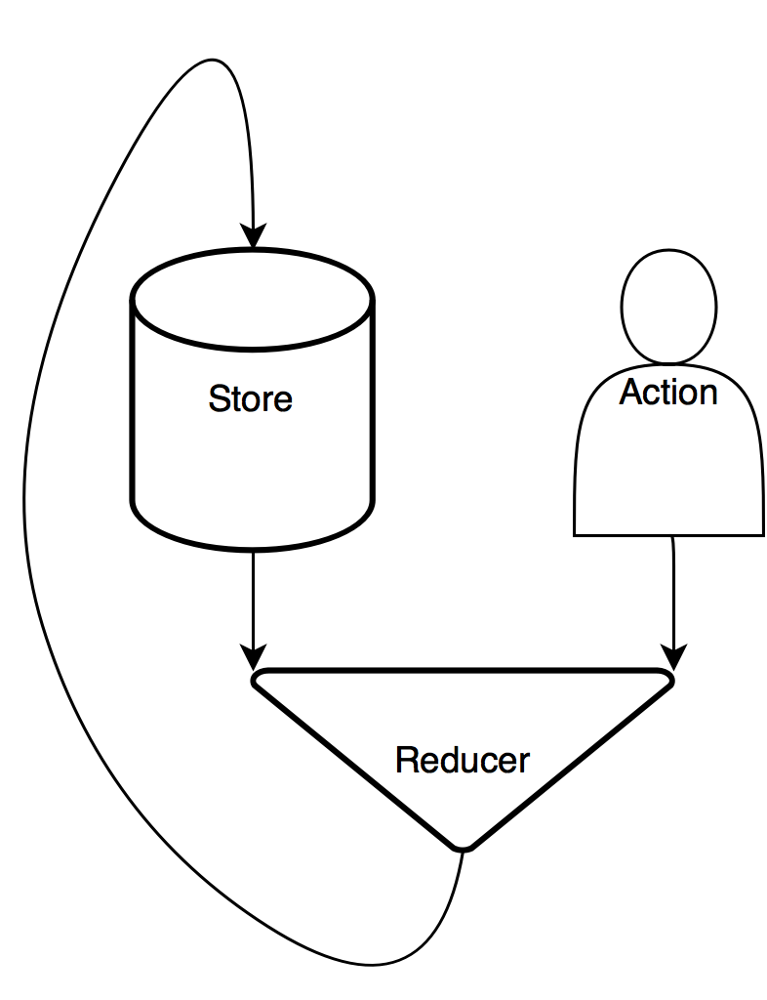
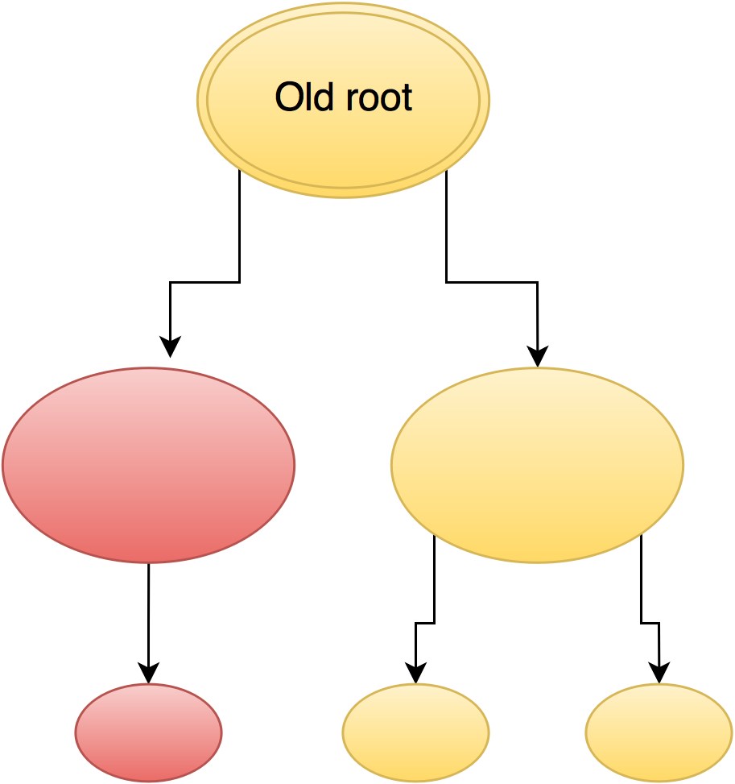
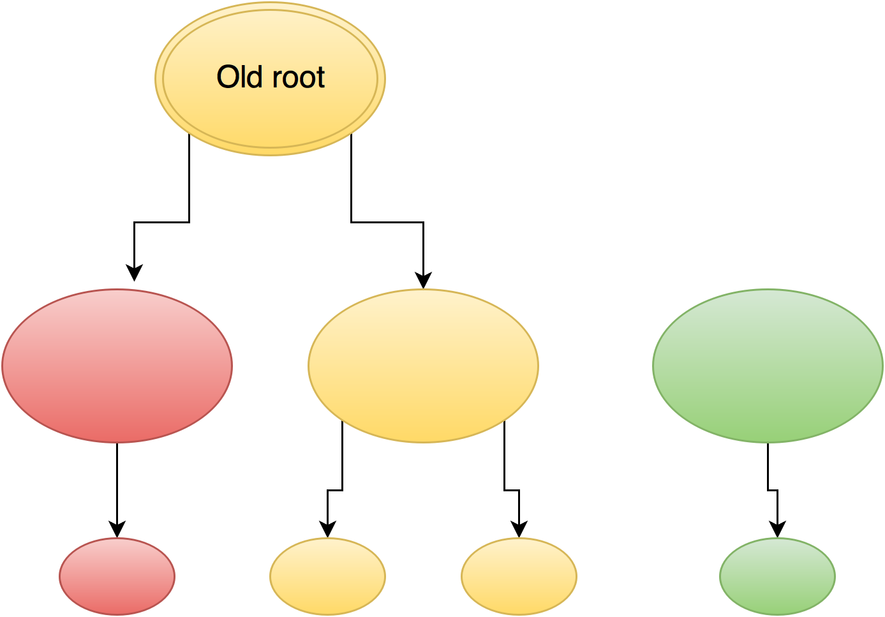
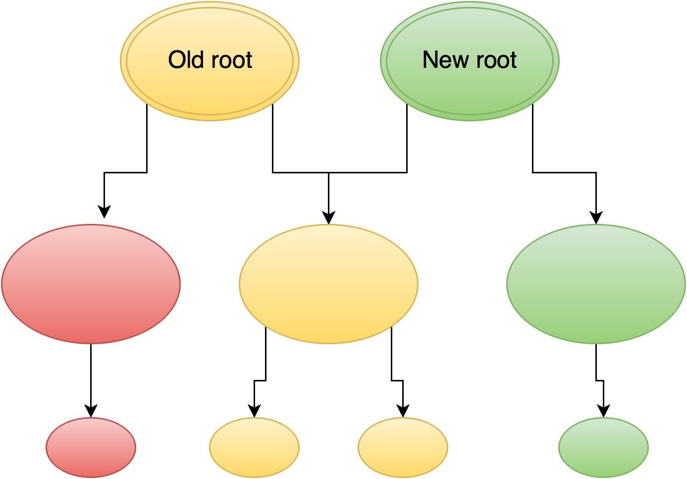
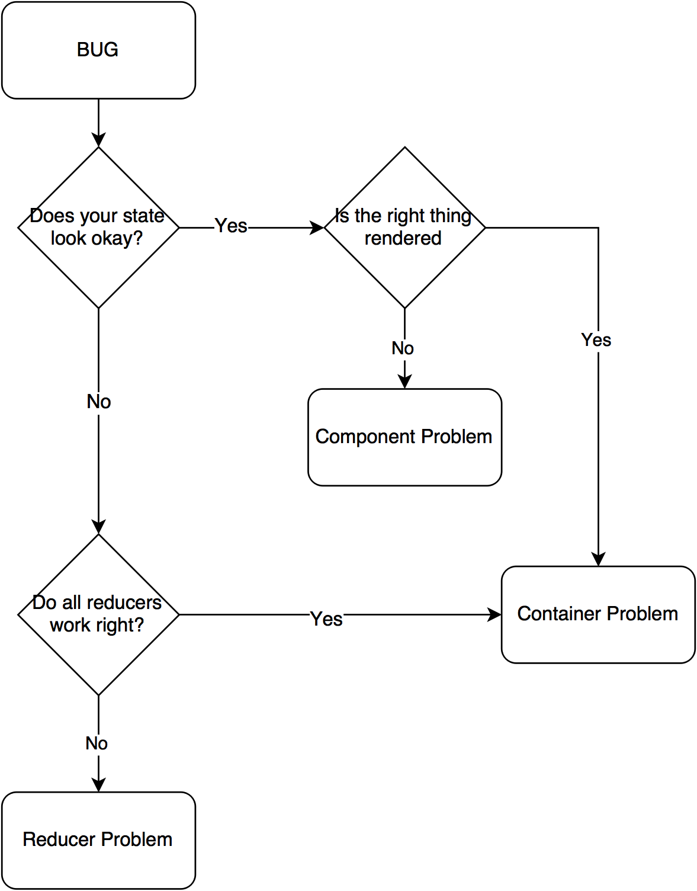

# ReactJS

### Structuring development

----

### ES6

The code in this presentation makes heavy use of [*ES6*](http://es6-features.org/). If you are not familiar with the syntax please look it up.

- [Arrow Functions](http://es6-features.org/#ExpressionBodies)
- [Constants](http://es6-features.org/#Constants)
- [Object.assign](http://es6-features.org/#ObjectPropertyAssignment)
- [Default values for parameters](http://es6-features.org/#DefaultParameterValues)
- [Exporting and importing](http://es6-features.org/#ValueExportImport)

Here is a [summarz of the above](http://hoverbaum.gitlab.io/2016/07/25/ES6-need-to-know/) or read [a full introduction to ES6 features](https://github.com/lukehoban/es6features).

---

# 💁 An introduction

----

[*ReactJS*](https://facebook.github.io/react/) takes a simple enough approach:

> For a given state describe how to render your application.

----

### 💁 Basic Example

```javascript
import React from 'react';
import { render } from 'react-dom';

render (
    <div>
        Hello React
    </div>,
    document.getElementById('#app')
)
```

Note:
Components need to be wrapped in a single parent.

----

### 💁 Components

A *Component* is a description of how to render a part of our application, like a button.

```javascript
//A simple button component.
import React from 'react';

const button = ({disabled, text, click}) => (
    <button onClick={disabled ? () => {} : click} >
        {text}
    </button>
)

export default button
```

Note:
Uses Destructuring to achieve named paramteres that is where the `{}` come from.

----

### 💁 Beyond the display

ReactJS renders our application.

Thus we need concepts and tools to compliment ReactJS when we want to build an application.

We need an approach to handle the state that is to be rendered.

---

# 📦 Redux

> Redux is a predictable state container for JavaScript apps.

----

### 📦 Reduxes idea

A popular approach to handle this `state` that ReactJS renders is [*Redux*](http://redux.js.org/).

It takes a unidirectional approach to dataflow. Meaning data only flows in a single direction. This makes our application more predictable.

----


<label for="flowDiagram">
    Visualizing dataflow in Redux
</label>

----

### 📦 Store

The *Store* is the current representation of the state of your application.

```javascript
//The store is simply one big object in JavaScript.
{
    printing: false,
    orders: [...]
}
```

----

### 📦 Actions

You can think of this as an event. While the *Action* is the actual thing being propagated there are also *Actioncreators* which are functions used to create an action.

```javascript
//Use ES6 Syntax to define a function.
export const startPrinting = () => {
    return {
        type: 'PRINTING_START'
    }
}
```

----

### 📦 Reducers

*Reducers* are function that take a current store and return a new one based on an Action.

```javascript
//Return a state for the action or a standard one.
const printing = (state = false, action) => {
    if(action.type === 'PRINTING_START') {
        return true
    } else if(action.type === 'PRINTING_STOP') {
        return false
    } else {        
        return state
    }
}
```

----

### 📦 Combining Reducers

```javascript
import { combineReducers } from 'redux';
import printing from './printing';
import orders from './orders';

const reducers = combineReducers({
  printing,
  orders
})

export default reducers
```

```javascript
const store = createStore(reducers)
```

Note:
This can then be used for `createStore` to build the store.
Just things Redux provides.

----

### 📦 Using the Store

```html
<Provider store={store}>
    <div>
        <Button text="Invert" />
    </div>
</Provider>
```

---

# ➡ Pure and Immutable

----

### ➡ Pure Functions

A pure function is one that fulfills two conditions:

- For a given input it always returns the same output
- It has no *"side effects"*

----

### ➡ Pure Components

```javascript
const button = ({disabled, text, click}) => (
    <button onClick={disabled ? () => {} : click} >
        {text}
    </button>
)
```

Our example from earlier is a pure function.

----

#### ➡ Impure Component

```javascript
import React from 'react';

let clicked = false
const doubleButton = ({click}) => {
	<button onClick={clicked ? click() : () => {clicked = true}}
		Click me twice
	</button>
}
export default doubleButton
```

----

### ➡ Immutable

> An immutable object is an object whose state cannot be modified after it is created

----



----



----



----

### ➡ Code example

Consider an array of Objects containing an id and some text.

```javascript
[
	{
		id: 'a unique ID here',
		text: 'this is some text'
	}, ...
]
```

Lets look at how to update a single Object in this array

----

### ➡ Code example

```javascript
function updateTextForId(array, id, newText) {
    return array.map(obj => {
        if(obj.id === id) {

            //Create a new object only where it is needed with the
			//updated text.
            return Object.assign({}, obj, {
                text: newText
            })
        } else {

            //Else just use the old object.
            return obj
        }
    })
}
```

----

### ➡ Gains

- Testability
- Predictability
- Timetravel

We gain a lot from making our Components and Reducers pure functions and also from making our Reducers work with immutable Objects.

---

# ↔ Routing

----

### ↔ Single page Application

[react-router](https://github.com/reactjs/react-router) is a complete routing library for React.

```javascript
render(
	< Provider store={store} >
		<Router history={history}>
			<Route path="/" component={App}>
				<IndexRoute component={Orders}  />
				<Route path="order/:orderId" component={OrderDetail} />
				<Route path="package/:orderId" component={Package} />
				<Route path="add/:packId" component={AddPackage} />
			</Route>
		</Router>
    < /Provider>,
    document.getElementById('app')
)
```

----

### ↔ Design decision: Login

FTL and backend handle *Login* and *Main* page, after that it is a single page application.

- Login in SPA is hard
- Frontend models things the backend does not care about
- Want to use React but backend uses FTL: only implement a Component in one language
	- [isomorphic approach](https://github.com/DavidWells/isomorphic-react-example) would be an improvement


---

# 📋 Folderstructure

----

### 📋 Overview

```text
.
├── docs                        All documentation lives here
│   ├── actions                 Redux Action documentation
│   ├── config                  Config to generate docs
│   └── templates               Templates to generate docs
├── node_modules                NPM dependencies
├── package.json            
├── src                        
│   ├── cssPre                  Your CSS preprocessing language of choice
│   ├── img                     Image resources
│   └── js                      JavaScript files
├── test                    
│   ├── reducers                Testing your reducers
│   └── test.js                 Entry point for all tests
└── webpack.config.js           Webpack configuration
```

----

### 📋 JS Folderstructure

```text
.
├── actions
│   └── index.js                Your Actioncreators
├── components                  Visible components
│   ├── button.js
│   └── orderList.js
├── containers                  Redux containers
│   └── visibleOrderList.js
├── index.js                    The main entry point
└── reducers                    Reducers for each part of the store
    ├── index.js
    └── ordersReducer.js
```

----

Folderstructure helps especially to quickly find the JS files to work on, mainly distinguishing between:

- Reducers
- Components
- Containers
- Actions

---

# 🚧 Implementing a feature

----

### 🚧 Three steps

1. Build the Components
2. Build the Reducer
3. Connect them

Note:
This is really amazing. Makes it predictable how complex things are.

---

# ⚙ Debugging

----

### ⚙ Find the problem

When you look at a problem with an app build on React and Redux there are three types of possible problems:

1. Rendering errors
2. State miscalculation
3. Problems connecting the Store to Components

----


<label for="flowDiagram">
    Find the source of a bug
</label>

----

### ⚙ React DevTools

Get the [Chrome extension](https://chrome.google.com/webstore/detail/react-developer-tools/fmkadmapgofadopljbjfkapdkoienihi).

- See what properties got handed to a Component
- Find out if its a Component or connection problem

----

### ⚙ Log Actions and state

edux can be extended using [middleware](http://redux.js.org/docs/advanced/Middleware.html). That same page suggests how to implement a [logging middleware](https://gist.github.com/HoverBaum/022905d9c6ca4f7fcd06664ea7e63415).

```javascript
import { createStore, combineReducers, applyMiddleware } from 'redux';
import { logger, crashReporter } from './loggingMiddleware';

let store = createStore(
  reducers,
  applyMiddleware(logger, crashReporter)
)
```

Note:
Redux also has devtools but they are a pain to set up. More pain then gain.

----

#### ⚙ Example logs

```javascript
next state
 Object {printing: false, orders: []}
dispatching
 Object {type: "PRINTING_START"}
next state
 Object {printing: false, orders: []}
 ```

----

### ⚙ Sourcemaps

> Using source maps allows developers to maintain a straight-forward debugging environment while at the same time optimizing their sites for performance.

Get pointed to `reducers/printing line: 13`  
instead of `build.js line: 13758`.

Note:
Chrome `Ctrl+P` to open file in Source tab of devtools.
Super helpful thing sourcemaps.

---

# 🔨 Buildprocess

----

ES6 and JSX need transpiling.

(Maybe also Polyfills)


----

### 🔨 Webpack

Get the [config file](https://gist.github.com/HoverBaum/2dec64c7395529e9bb93af92d7c7e544#file-webpack-config-js) and setup an [npm script](https://docs.npmjs.com/misc/scripts).

```javascript
"webpack": "node node_modules/webpack/bin/webpack.js
 	--progress --colors --watch"
```

```bash
$ npm run webpack

> react-basic@0.1.0 webpack D:\react-basic
> node node_modules/webpack/bin/webpack.js --progress --colors --watch

Hash: 9f2265bc4db2c1e07831
Version: webpack 1.13.1
Time: 1810ms
      Asset    Size  Chunks             Chunk Names
    main.js  727 kB       0  [emitted]  main
main.js.map  849 kB       0  [emitted]  main
    + 172 hidden modules
```

Note:
That should be one line but looks better like this on slides.

----

### 🔨 See the result

Create an `index.html` in your build folder and use [live-server](https://www.npmjs.com/package/live-server) to see the result.

```JavaScript
"serve": "./node_modules/.bin/live-server ./build"
```

| pros | cons |
|:---:|:---:|
| fast refresh | no FTL |

But we can substitute [puer-freemarker](https://www.npmjs.com/package/puer-freemarker) to get only the pros and response mocking.

Note:
Project used FTL for server side rendering.

----

### 🔨 Different Webpack builds

Use an environment variable to define the build folder.

```javascript
//npm script
"webpack-dev": "set DEV=true && node node_modules/webpack/bin/webpack.js"

//Calculate different folder based in variable.
function outputFolder() {
	if(process.env.DEV.trim() === 'true') {
		return 'res'
	}
	return 'devBuild'
}

//In the config object
output: {
    path: path.join(__dirname, outputFolder(), 'js'),
    filename: "[name].js"
}
```

---

# 🔧 Testing

----

### 🔧 What and how

**Components**: manually

**Reducers**: unit tests

----

### 🔧 Reducers

Since our reducers are pure functions they are an ideal thing to test.

[*Tape*](https://github.com/substack/tape) is a lightweight testing framework for JavaScript. Let's look at how to use it for our ReactJS application.

----

### 🔧 Setup

A nice Tape environment with some pretty output and the ability to use ES6 `import` requires a bit of setup and an npm script.

```bash
npm install --save-dev tap-spec tape browserif babelify deep-freeze-node
```

```JavaScript
"test": "node ./node_modules/browserify/bin/cmd.js test/test.js
	-t [ babelify --presets [ es2015 react ] ] | node | tap-spec"
```

----

### 🔧 Testfiles

```text
.
├── reducers
│   ├── orders.js               Testing orders reducer
│   └── printing.js             Testing printing reducer
└── test.js                     Entry point for all tests
```

```javascript
//test.js
const test = require('tape')

require('./reducers/order')(test)
require('./reducers/printing')(test)
```

----

### 🔧 Simple testcase

```javascript
import printReducer from '../../src/js/reducers/printing';
import { startPrinting } from '../../src/js/actions';

module.exports = function testText(test) {
    test('Printing', function(t) {

        const store1 = printReducer(undefined, {})
        t.equal(store1, false, 'Initial Value correct')

        const secondText = 'Hello World'
        const store2 = printReducer(store1, startPrinting())
		t.equal(store2, true, 'Started printing')

		//More tests here and thens end this test case.
        t.end()
    })
}
```

---

# 🎓 Lessons learned

----

### 🎓 Normalize the Store

Three weeks into development and suddenly all I do is dive deep into nested objects to find correlating ones.

Pull Objects out, give them IDs and reference those.

----

#### 🎓 Before

```javascript
orders: [
	{
		orderId: 'ordersId',
		name: 'John Doe',
		packs: [
			{
				packId: 'packId'
			}, ...
		]
	}, ...
]
```

At `/pack/packId` which is the corresponding order?

----

#### 🎓 After


```javascript
orders: [
	{
		orderId: 'ordersId',
		name: 'John Doe',
		packs: ['packId', ...]
	}, ...
],
packs: [
	{
		packId: 'packId',
		orderId: 'orderId'
	}, ...
]
```

----

### 🎓 Compute in Components

**Task**: given the already delivered items and the total amount of items that need delivering, calculate the packages that need to be delivered.

Influenced by the Order which has all things that need delivering and packaged packs.

----

#### 🎓 In Reducers

Have both the *Orders* and *packs* Reducer calculate a *toBeDelivered*.

**Problems:**
- Reducers only know their own space in the Store
- Where should this be saved
- Create a way to only implement this once

**Result:** super messy and buggy

----

#### 🎓 In Component

There is only one component which wants to display this and if we have the packs and the order this is a simple transformation.

**Benefits:**
- Single point of implementation
- Less code
- Easier to reason about

---

# 📓 Links

Helpful things and further reading.


----

### 📓 Follow the links

- [Introducing React](https://www.youtube.com/watch?v=XxVg_s8xAms) (🎬)
- [ReactJS repos](https://github.com/reactjs/)
- [Redux docs](http://redux.js.org/)
- [Blogpost](http://hoverbaum.gitlab.io/2016/07/21/Why-and-how-to-ReactJS/) me on how to set this all up
- [Basic setup](https://github.com/HoverBaum/react-basic) repo with basic setup as discussed here

----

### 📓 This is build using:

- [Reveal](https://github.com/hakimel/reveal.js/) for JS based slides
- [Reveal-md](https://github.com/webpro/reveal-md) for prototyping
- [nodetree](https://www.npmjs.com/package/nodetree) for nice filetrees

----

# Code on

<!-- Create some styles -->
<style>
    @media print {
        img {
            min-height: 300px;
        }
    }
</style>
